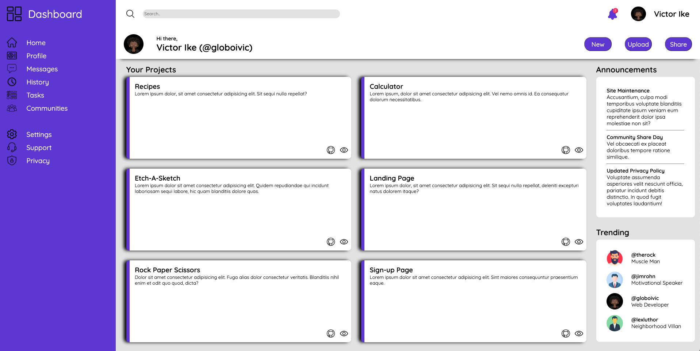

<h1 align="center">Odin Admin Dashboard</h1>

   A Project from <a href="https://www.theodinproject.com/" target="_blank">The Odin Project</a>.

  <h3>
    <a href="https://globoivic.github.io/Odin-Admin-Dashboard/">
      Demo
    </a>
     | 
    <a href="https://github.com/GloBoiVic/Odin-Admin-Dashboard">
      Github Repo
    </a>
     | 
    <a href="https://www.theodinproject.com/lessons/node-path-intermediate-html-and-css-admin-dashboard">
      Project Description
    </a>
  </h3>

## :file_folder: Table of Contents

- [General Info](#general-information)
- [Technologies Used](#technologies-used)
- [Features](#features)
- [Screenshots](#screenshots)
- [Room for Improvement](#room-for-improvement)
- [Contact](#contact)

## :page_facing_up: General Information

Project Admin Dashboard in the Odin Intermediate HTML and CSS course

## :computer: Technologies Used

- HTML
- CSS
- SCSS

## :fire: Features

Built with CSS Grid and Flexbox mixed in

## :camera: Screenshots

## :heavy_exclamation_mark: Room for Improvement

To improve this project, I would like to:

- Add my project screenshots to the page
- Make dashboard fully responsive by adding media queries.

## :bust_in_silhouette: Contact

- GitHub [@GloBoiVic](https://github.com/vicdatrader) - please reach out to me! I want to connect with other coders!
